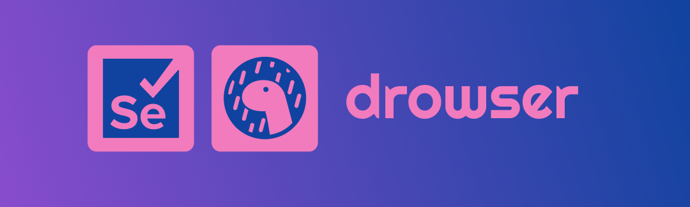

<p align="center">
  
</p>

[](https://deno.land/x/drowser)


A easy way to implement and write Selenium with TypeScript using Deno 🦕

> Still working on managing custom function test using selenium webdriver builder ℹ️
>
> But for now we have already implemented test using object type like you can see in the usage section 🚀
>

## Features

- Easy handling on driver side web browser to isolate each test ✅.
- Get a daily log file to check all test process if passed or failed ✅.
- Possibility to export test case as Log ✅.
- Usage of AI for analyse the percentage of passed and failed test 🛠️.

## Configuration

You need to create a drowser.json in root directory and define some configuration like this:

- `url`: The url of platform or website you want to test
- `exportPdf`: Set to `true` if you want to export your test reports inside a pdf file

```json
{
  "url": "http://url_of_the_platform_need_to_tested",
  "exportPdf": false
}
```

## Usage

In your test file , you can define a sample test like this:

List of `method` usable:

- getAllWindowHandles
- getCapabilities
- getCurrentUrl
- getExecutor
- getPageSource
- getSession
- getTitle
- getWindowHandle
- getWsUrl

List of `operator` usable, you can find it [here](https://junit.org/junit4/javadoc/4.13/org/junit/Assert.html)

For `except` , add your exceptation string

```ts
import { driver } from "https://deno.land/x/drowser@v0.1.1/mod.ts"

driver({ browserType: 'chrome' }).then(({ service }) => {
 service.cases = [
  {
   method: 'getTitle',
   operator: 'assertEquals',
   except: 'Todo App',
  },
 ]
}).catch((error) => {
 console.log(error)
})
```

With this test we only test this sample code inside a Chrome Webdriver but you can create a test for another web browser like Firefox, Edge, Safari 🚀

## LICENSE

[MIT](LICENSE).
