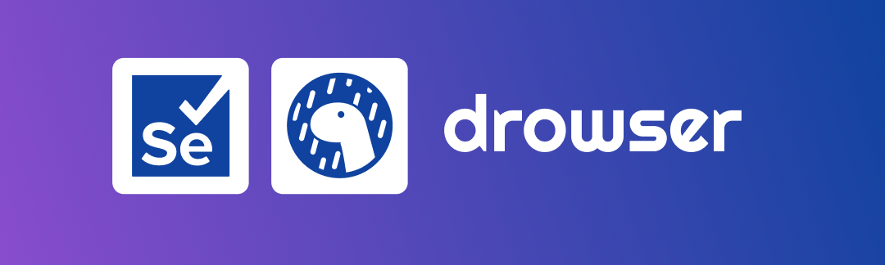

<p align="center">
  
</p>


[](https://deno.land/x/drowser)


A easy way to implement and write Selenium with TypeScript using Deno 🦕

## Features

- Easy handling on driver side web browser to isolate each test ✅.
- Get a daily log file to check all test process if passed or failed ✅.
- Export each test case inside the reports ✅.

## Configuration

Create a drowser.json in root directory and define some configuration like this:

- `url`: The url of platform or website that need to be test

```json
{
  "url": "http://url_of_the_platform_need_to_be_tested"
}
```

## Deno 2

Install npm dependecies on `node_modules` with this command:

```sh
deno install --allow-scripts
```

## Usage

In test file , Define a sample test like this:

With this test we only test this sample code inside a Chrome ,Firefox but create a test for another web browser like Edge, Safari 🚀

```ts
import { driver } from "https://deno.land/x/drowser@v0.1.6/mod.ts";

driver({ browser: "chrome" })
  .then(({ service }) => {
    service.cases = [
      {
        name: "Verify Failed Title",
        fn: async ({ builder, assert }) => {
          const title = await builder.getTitle();
          assert.assertEquals(title, "Drowsers");
        },
      },
      {
        name: "Verify Title",
        fn: async ({ builder, assert }) => {
          const title = await builder.getTitle();
          assert.assertEquals(title, "Drowser");
        },
      },
    ];
  })
  .catch((error) => console.log(error));

driver({ browser: "firefox" })
  .then(({ service }) => {
    service.cases = [
      {
        name: "Verify Failed Title",
        fn: async ({ builder, assert }) => {
          const title = await builder.getTitle();
          assert.assertEquals(title, "Drowsers");
        },
      },
      {
        name: "Verify Title",
        fn: async ({ builder, assert }) => {
          const title = await builder.getTitle();
          assert.assertEquals(title, "Drowser");
        },
      },
    ];
  })
  .catch((error) => console.log(error));
```

## Drowser Studio

> Note: The `Drowser Studio` is a community-driven project and is open-source.

Each test case is saved inside the `drowser-reports.json` file , and this file is exploitable inside the `Drowser Studio` who is developed by the `Kinotio` Team in this [repo](https://github.com/kinotio/drowser-studio) , who is open-source

Import this reports inside of the studio to visualize all the metrics for main cases or each test case

## Report

The `drowser-reports.json` file provides a comprehensive overview of the test execution metrics and individual test case details. This file is generated after running your tests and can be used to analyze the results and performance of your test suite.

You can import the `drowser-reports.json` file into the [Drowser Studio](https://drowser.kinotio.io/) to visualize and analyze the metrics for each test case. This helps in identifying issues, understanding test coverage, and improving the overall quality of your test suite.

For more details on how to use [Drowser Studio](https://drowser.kinotio.io/), refer to the [Drowser Studio Repository](https://github.com/kinotio/drowser-studio).

### Report Structure

- **Metrics**: High-level summary of the test execution.
  - **Total Tests**: The total number of tests executed.
  - **Passing Tests**: The number of tests that passed.
  - **Failed Tests**: The number of tests that failed.
  - **Test Coverage**: The percentage of code covered by the tests.
  - **Average Test Duration**: The average time taken to execute the tests.
  - **Flaky Tests**: The number of tests that are inconsistent in their results.

- **Graphs**: Visual representation of the metrics over time.
  - **Total Tests**: Monthly data showing the number of tests executed.
  - **Passing Tests**: Monthly data showing the number of tests that passed.
  - **Failed Tests**: Monthly data showing the number of tests that failed.
  - **Test Coverage**: Monthly data showing the test coverage percentage.
  - **Average Test Duration**: Monthly data showing the average test duration.
  - **Flaky Tests**: Monthly data showing the number of flaky tests.

- **Test Cases**: Detailed information about each test case executed.
  - **ID**: Unique identifier for the test case.
  - **Time**: Timestamp of when the test was executed.
  - **Average Duration**: Average time taken for the test case.
  - **Coverage**: Code coverage percentage for the test case.
  - **Flaky**: Indicator if the test case is flaky.
  - **Month of Test**: The month in which the test was executed.
  - **Browser**: The browser used for the test execution.
  - **Cases**: Array of individual test case results, each containing:
    - **ID**: Unique identifier for the individual test.
    - **Name**: The name of the test.
    - **Status**: The result of the test execution (e.g., "passed", "failed").
    - **Timestamp**: The exact time the test was executed.
    - **Duration**: The time taken to execute the test.
    - **Month of Test**: The month in which the test was executed.
    - **Browser**: The browser used for the test execution.

- **Metadata**: Additional information about the test execution.
  - **Current Month**: The current month of the test execution.

## LICENSE

This project is licensed under the MIT License - see the [LICENSE](LICENSE) file for details.
